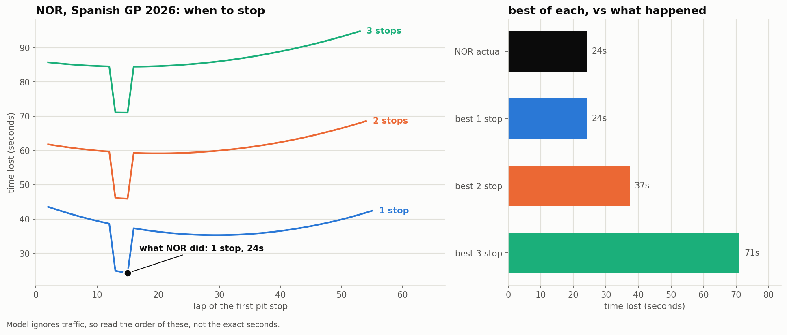
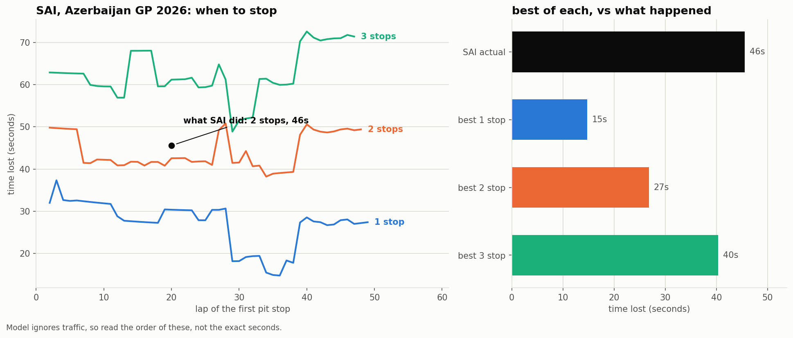

# F1 Strategy Lab

**[Try it → vashen.me/f1-strategy-lab](https://vashen.me/f1-strategy-lab/)**
Pick any driver from any 2026 race and see what their pit strategy cost, what
the best alternative was, and whether it would have changed where they finished.

Working out how fast F1 tyres wear out in the 2026 season, and using that to
figure out **what strategy a driver should have run.**

Built with [FastF1](https://github.com/theOehrly/Fast-F1).

**New here? Read [EXPLAINED.md](EXPLAINED.md) first.** Same story, no jargon, no
maths. This file has the numbers and the method.

## The question

A pit stop costs you about 20 seconds. Old tyres cost you a bit of time every
single lap.

So basically: **is the time you get back from fresh tyres worth the 20 seconds
it costs to get them, and if it is, when should you stop?**

To answer that we need two numbers:

1. **Degradation.** How many seconds a lap you lose as the tyre gets older.
2. **Pit loss.** How many seconds a stop actually costs at that circuit.

Once we have both, we can simulate strategies and see which one loses the
least time.

## Why it's hard

You can't just look at a driver's lap times and say "that's degradation". Loads
of other stuff is changing at the same time, and anything we don't take out
gets blamed on the tyre.

| What's changing | What it does to lap time | Sorted? |
| --- | --- | --- |
| Car burning fuel and getting lighter | faster | yes, step 2 |
| Some circuits are just harsher on tyres | varies | yes, step 4 |
| Track rubbering in during the race | faster | yes, step 5 |
| Being stuck behind another car | slower | yes, step 6 |
| Tyre getting older | slower | this is the one we want |

## Where it's at

- **Degradation per circuit:** working
- **Pit loss per circuit:** working (12 of 15 circuits)
- **Simulator:** working, picks the best number of stops for each circuit
- **Degradation per compound (soft vs hard):** tried it, the data can't do it. Explained below
- **Monte Carlo (safety cars):** working
- **Validation:** done, and the honest answer is mixed. See step 10
- **Traffic:** measured and added, but it turned out not to be the problem. See step 12
- **What if tool:** working, with charts

All results below are from the first 15 rounds of 2026 (up to Azerbaijan).

## Results

### Degradation per circuit

Seconds lost per lap of tyre age, clean air only:

| Circuit | Degradation | Makes sense? |
| --- | --- | --- |
| Barcelona | 0.139 | rough surface, long fast corners, known for destroying tyres |
| Hungary | 0.088 | corner after corner, the tyre never gets a break |
| Austria | 0.081 | short lap with loads of hard acceleration |
| Japan | 0.064 | fast flowing corners, lots of load |
| Netherlands | 0.063 | banked corners push the tyres hard |
| Britain | 0.059 | high speed corners |
| Belgium | 0.054 | long lap but plenty of straights to cool down |
| Australia | 0.047 | smooth track |
| China | 0.027 | |
| Monaco | 0.024 | really slow, hardly any load on the tyres |
| Miami | 0.022 | |
| Italy | 0.013 | Monza is basically all straights |
| Spain | 0.011 | barely wears the tyres at all |
| Azerbaijan | 0.005 | gentlest of the whole season. Baku is mostly straight lines |
| Canada | **-0.017** | **impossible, still weird and we don't know why yet** |

How to read it: at Barcelona a tyre that's 20 laps old is about **2.8 seconds
a lap** slower than a new one. At Monaco the same tyre is only about **half a
second** slower.

The cool thing is we never told the code anything about the tracks, only lap
times. It worked out by itself that Barcelona is the harshest, Monaco is gentle
and Monza is the gentlest, which is exactly what anyone in F1 would tell you.

### Pit loss per circuit

| Circuit | Pit loss (s) | Spread | Stops used |
| --- | --- | --- | --- |
| Canada | 27.8 | 7.4 | 13 |
| Spain | 26.8 | 2.3 | 14 |
| Barcelona | 23.8 | 1.8 | 40 |
| Australia | 23.6 | 8.1 | 8 |
| Monaco | 22.4 | 2.0 | 17 |
| Japan | 22.4 | 1.7 | 10 |
| Hungary | 22.0 | 2.0 | 33 |
| Austria | 21.4 | 1.2 | 33 |
| Britain | 21.3 | 5.2 | 21 |
| Belgium | 20.8 | 4.5 | 9 |
| Miami | 19.6 | 1.3 | 18 |
| Netherlands | 19.4 | 2.1 | 36 |
| China | not trusted | | only 4 |
| Italy | not trusted | | only 2 |
| Azerbaijan | not trusted | | only 2 |

Typical pit loss is **21.9 seconds**, which is right where real F1 pit loss
sits (roughly 16 to 30 depending on the track).

Spread is how much the drivers disagree with each other. At Barcelona 40 stops
all agree within 1.8 seconds, so that number is solid. Canada and Spain are the
two most expensive places to stop, but Canada's drivers disagree by 7.2s and
Spain's only by 2.3s, so Spain's number is the better measurement even though
it's the lower one.

### Best number of stops (the simulator)

| Circuit | Our model says | Real field actually did | |
| --- | --- | --- | --- |
| Austria | 2 | 2 | ✅ |
| Barcelona | 3 | 3 (split between 2 and 3) | ✅ |
| Belgium | 1 | 1 | ✅ |
| Hungary | 2 | 2 | ✅ |
| Japan | 1 | 1 | ✅ |
| Miami | 1 | 1 | ✅ |
| **Spain** | **1** | **1** (14 of 18 finishers) | ✅ |
| Australia | 1 | 2 | one off |
| Britain | 1 | 2 | one off |
| Netherlands | 2 | 3 | one off |
| Monaco | 1 | 5 | way off |

**7 out of 11 exactly right, and 3 more only off by one.**

### Spain was a real out of sample test

Every other circuit in that table was already in the data when the model was
built. Spain wasn't. It's round 14, the model was built on the first 13, and we
didn't change a single setting for it.

The model said **1 stop**, and **14 of the 18 finishers did 1 stop**.

It makes sense from the two numbers too. Spain has expensive stops (26.8s) and
tyres that barely wear (0.011), so paying 27 seconds for tyres that were fine
anyway is a waste. You stop once because the rules make you and thats it.

The interesting bit is every time it's wrong, the real teams stopped **more**
than the model said, never less. When we split out the stops made under a
safety car, the extra ones were basically all safety car stops:

| Circuit | Model | Real, green flag stops only |
| --- | --- | --- |
| Australia | 1 | 0 |
| Britain | 1 | 1 |
| Netherlands | 2 | 2 |
| Monaco | 1 | 1 |

That makes sense. When a safety car comes out everyone is driving slow, so a
stop is suddenly cheap and teams grab fresh tyres. **The model plans a clean
race and doesn't know safety cars exist yet**, which is exactly what Monte
Carlo is going to fix.

## How we got here, step by step

### Step 1: look at the data

Plot lap time vs tyre age for one driver, one line per stint, and fit a straight
line through each. The slope is the degradation.

We only use "clean" laps: green flag, not going in or out of the pits, and
FastF1 thinks the timing is accurate.

**Result:** slopes were way too small (0.007 to 0.087) and the stints were 3
seconds apart from each other. Something was hiding the degradation.

### Step 2: fuel

A 2026 car starts with around 72 kg of fuel and ends near empty. Lighter is
faster, about 0.03 seconds per kg. So the car gets faster all race for reasons
that have nothing to do with tyres.

```
corrected time = raw time - (laps remaining) x kg per lap x 0.03
```

**Result:** slopes roughly doubled and the gap between stints went from 2.5s
to 0.8s.

We also tried 70, 72 and 75 kg to see if the guess mattered. The answer moved
by less than 0.005 s/lap, so it doesn't really matter which one we pick.

### Step 3: every driver in one race

4 stints from one driver doesn't prove anything, so we did all 22 drivers at
Hungary.

**Result:** hards looked like they degraded **faster** than softs, which is
backwards. At Hungary mediums were only used at the start, hards in the middle
and softs at the end, so we couldn't tell "which tyre" apart from "when in the
race".

### Step 4: every race

Pool all the races together so each tyre shows up at different points in a
race.

**Result:** still backwards. Then we found out why. Teams pick hards
**because** the track is harsh:

```
             SOFT  MEDIUM  HARD
Canada         19      22     2     <- one of the easiest tracks on tyres
Barcelona       9      18    34     <- the harshest
```

So the hard pile was mostly Barcelona and the soft pile was mostly Canada. We
were comparing tracks, not tyres.

When we compared each stint only against other stints **at the same race**, all
three tyres came out at zero. The backwards result was about tracks the whole
time.

### Step 5: track evolution

Cars lay rubber down so the track gets grippier and lap times drop. Canada and
China even showed **negative** degradation (tyre getting faster with age),
which can't happen, so something was missing.

We can't look this one up like fuel so we measure it. The trick is that
**drivers pit at different times.** On lap 30 one driver might be on 18 lap old
tyres and another on 5 lap old tyres. Same track at the same moment, so any gap
between them has to be the tyres.

**Result:** the track gives back about **1 to 2 seconds** over a race, which is
normal for F1. China got fixed, Canada is still negative. Miami and Monaco
actually got **slower**, probably heat at Miami.

It couldn't fix soft vs hard though. The track is the same for everyone so it
shifts every stint in a race by the same amount, and that can't change the
order.

### Step 6: traffic

Following another car means driving in its dirty air, less grip and a slower
lap. Our fit was blaming that on the tyre.

FastF1 doesn't have a "gap to the car ahead" column so we built it. Sort the
cars by when they crossed the line, take away the time of the car in front, and
that's the gap. Under 1.5 seconds counts as dirty air and the lap gets thrown
out.

**How much does dirty air actually cost?** We went back and measured it properly,
seconds lost per lap compared to being in clean air:

```
gap to car ahead    season median
< 0.5s                   +0.615
0.5 - 1.0s               +0.289
1.0 - 1.5s               +0.071
1.5 - 2.0s               +0.015
2.0 - 3.0s               -0.053
```

So it fades out by about 1 to 1.5 seconds, which means our 1.5s cutoff is safely
past the point where it matters. Monaco is the worst at **+2.1 seconds a lap**
when youre within half a second, because theres nowhere to pass so you just sit
there.

Worth knowing for 2026: being within 1 second gets you overtake mode from the new
battery system, so you should get some time back on the straights. The data says
it helps but doesnt cancel dirty air out, because the 0.5 to 1.0 band still costs
+0.29 a lap.

**Result:** the circuit numbers got better, but soft vs hard still didn't move:

```
             stints  negative  soft_hard   SOFT   MEDIUM   HARD
no filter       496         1        6/9  -0.000  +0.002  -0.001
>= 1.5s         379         1        4/9  -0.001  +0.003  -0.000
>= 3.0s         288         1        4/9  -0.007  +0.002  -0.000
```

### Step 7: pit loss

A pit stop wrecks two laps, the in lap and the out lap:

```
pit loss = (in lap + out lap) - (2 x normal lap)
```

The normal lap is the driver's own median pace around the stop.

We throw out:
- **Red flag stops.** Tyres get changed for free on the grid. At Monza, Leclerc
  crashed on lap 3 and 21 of the 32 stops were from that red flag
- **Safety car and VSC stops.** Everyone's slow so the stop is cheap
- **Circuits with less than 8 stops.** Not enough to trust (China and Italy)

We originally only dropped the red flag stops by accident, because FastF1
leaves their lap times empty. Now the code checks for red flags on purpose.

### Step 8: the simulator

Fuel, track evolution and car speed are the same whatever strategy you pick,
so they cancel out. Only two things change between strategies:

```
time lost = deg x (tyre age added up over every lap) + stops x pit loss
```

We built a function that goes lap by lap, adds up what the tyre costs, and adds
the pit loss whenever you stop.

Some things we found at Barcelona:

- **The best single stop is right in the middle (lap 34).** Stopping early or
  late are both bad because one of the tyres ends up really old. Stopping on
  lap 50 was even worse than lap 20
- **So stints should always be evenly split**, which means we don't need to try
  millions of combinations
- **There's a sweet spot for how many stops:**

```
1 stop     171.0 s lost
2 stops    144.2
3 stops    142.8   <- best
4 stops    151.4
5 stops    165.1
```

Too few stops and the tyres get ancient. Too many and you keep paying for tyres
that weren't even worn yet.

At Barcelona 2 and 3 stops are only 1.4 seconds apart, basically a tie. And the
real field split exactly 7 and 7 between them.

### Step 9: Monte Carlo, adding randomness

Step 8 plans a perfectly clean race, which is why it kept saying fewer stops than
the real teams did. Real races have safety cars, and a safety car makes a stop
way cheaper because everyone else is crawling.

We measured how often they actually happen instead of guessing:

```
full safety car :  7 periods / 855 laps = 0.0082 per lap
SC + VSC        : 28 periods / 855 laps = 0.0327 per lap
```

We count **periods**, not laps. Monaco had 1 safety car that stayed out for 14
laps, thats one event not fourteen. Using laps would spawn new safety cars over
and over.

Version 1 uses full safety cars only (0.82% chance per lap, lasting about 7 laps)
and assumes a stop under one costs half as much.

Then we run the same strategy 10,000 times, rolling fresh safety cars each time,
and average it.

**Finding 1: more stops benefit more from safety cars.**

```
stops   clean race   with safety cars   saved
1            171.0              170.3     0.7
2            144.2              142.8     1.4
3            142.8              140.8     2.0
```

About 0.7s per stop. Each stop is basically a lottery ticket on a safety car
landing at the right moment.

**Finding 2: reacting to a safety car only helps if it comes close to when you
were going to stop anyway.**

```
react window   avg time lost
           0          140.89     ignore safety cars
           4          140.04     best
          30          153.01     always pit under safety car
```

Always pitting under a safety car is **12 seconds worse than never reacting**.
Pit 15 laps early and you save 12s on the stop but wreck your stint balance, so
one tyre ends up ancient. Thats why you sometimes see a team leave a driver out
under a safety car while everyone at home screams at the telly.

**Nothing in here is hand picked.** It tries every reaction window from 0 up to
the first planned stop, and keeps adding pit stops until they stop helping. Our
first version used a list of windows I had just chosen, which meant the answer
could only ever be the best of six numbers I happened to pick.

To make a fine search work we needed one more trick, called **common random
numbers**. Roll 2000 safety car scenarios ONCE, then test every strategy
against those exact same 2000 races. Otherwise one option can just get lucky
dice, and with windows 4 and 5 differing by less than the luck does, the search
would pick whichever got the nicer roll. Same logic as comparing teammates
instead of comparing different teams.

It also means far fewer runs are needed, so the whole fine search takes about 5
seconds. We never needed numpy for any of it. Good thing we measured before
optimising.

**And the best window changes completely by circuit:**

```
Barcelona   deg 0.139   ->  3 stops, window 4     be picky
Monaco      deg 0.024   ->  1 stop,  window 14
Spain       deg 0.011   ->  1 stop,  window 22    take anything
```

The lower the degradation, the wider the window. It makes sense once you see
it: the cost of pitting early is unbalanced stints, and that cost is made of
degradation. At Barcelona pitting 15 laps early is a disaster. At Spain a lap
of tyre age costs 0.011s, so pitting early costs almost nothing while the
safety car still saves you 13 seconds.

### Step 10: validation, how wrong is it?

Everything before this checked the model against things we already knew. This
is the first time we put a number on how wrong it is.

**The idea.** Nobody has an answer key for "what was the best strategy". But we
do have one for "how far apart did two drivers finish". So we take **teammates**
who ran different strategies, feed their real pit laps into the model, and see
if the gap it predicts matches the gap that really happened.

Teammates because they share the same car, so most of what is left between them
is the strategy. And we use the **change** in the gap from the end of lap 1 to
the flag, so starting position doesnt count.

**First attempt: failed.** Assuming teammates are identical was wrong, one of
them is usually just quicker on the day, and that swamped everything.

```
                     correlation   direction right   median error
strategy only            0.28         26 of 43          13.3s
say nothing               -               -              9.3s
```

Worse than useless. Guessing "no difference at all" beat it.

**Second attempt: add how quick each driver actually was.** Measured from the
step 5 fit, on clean air laps only, with tyre age taken out. Clean air only
matters: if we used every lap then a driver stuck in traffic would look slow and
we would be feeding the answer back into the question.

```
                     correlation   direction right   median error
strategy + pace          0.71         33 of 43          12.5s
```

The model now knows **which** teammate gained from their strategy 77% of the
time. But it still got the **size** wrong, always the same way: it predicted
about twice as much as really happened.

**Third: correct the size, honestly.** A consistent error can be corrected, but
if you work out the correction on all the races and then report how good it is
on those same races, of course it looks good. So we split the season in half,
worked out the correction on one half, and tested it on races the correction had
never seen. Then swapped and did it again.

```
  pairs tested            43
  say nothing             9.3s
  our model, uncorrected  12.5s
  our model, corrected     8.2s
  within 10 seconds       25 of 43
```

**The honest verdict.** It beats guessing, but only just, and the correction
itself wasnt stable (one half wanted x0.35 and the other x0.80). So:

- **Picking a strategy: works.** 7 of 11 circuits matched the real field, it got
  Spain right on a race it had never seen, and it picks the better teammate
  strategy 77% of the time.
- **Predicting a gap in seconds: not really.** Typical error about 8 seconds
  against gaps that are typically 9, and no stable correction factor.

Why: the model has no idea other cars exist. Rejoin behind a slower car and you
lose 10 seconds, and it cant see any of that. Same reason we couldnt measure
compounds back in step 6, the thing we want is smaller than the noise around it.

### Step 11: the what if tool

Take a driver's real race, try what they could have done instead, and say what
each option would have been worth.

1. Pull their real pit laps out of the data and cost them with the model
2. Try every alternative. 1, 2 and 3 stops at every lap
3. Best alternative minus what they did = seconds left on the table
4. Turn those seconds into positions using the real gaps around them

It uses the REAL safety cars from that race, not random ones like step 9, so
the alternatives get judged in the same conditions the driver actually had.

**Example: Norris, Spain 2026.**

```
safety car on laps: [13, 14, 15]
he stopped on lap:  [15]

best 1 stop: [15]           25.3s      +0.0s
best 2 stop: [13, 15]       39.1s     -13.8s
best 3 stop: [14, 24, 40]   71.7s     -46.4s
```

**The model says he ran the single best strategy available.** Not a good one, the
best one. Out of every combination it tried, nothing beat what he actually did.

He finished 3rd, 0.7 seconds behind Verstappen.



You can see it on the chart. The dip in all three lines around laps 13 to 15 is
the safety car, where a stop is half price. Norris is the black dot, sitting
right at the bottom of it.

**So why did he lose the position?** Not the strategy. The stop itself:

```
driver  lap  time in the pit lane
NOR      15        35.0        <- P3
ANT      14        31.8        <- P1
VER      14        31.1        <- P2
median    -        31.6
```

He was **3.2 seconds slower than his teammate in the pit lane**, and lost P2 by
0.7. That one stop was the whole race.

I spotted this watching the race. Norris ran what looked like the same strategy
as Antonelli and still finished behind him, and his stop had visibly taken
longer.

**So the tool now splits a race into two separate questions.** Was the plan good,
and was the stop good? They are different problems and they have different
people to blame.

```
tyres and stops           24.2s
traffic                   +1.1s
their plan cost           25.3s
their stops cost          +3.4s
total                     28.7s

THE PLAN:  they basically nailed it, nothing beat it by more than 0.0s
THE STOPS: they lost 3.4s in the pit box compared to a normal stop here

3.4s would have got them past: VER, so 1 position better
```

It works out the stop bit by comparing each driver's time in the pit lane
against the typical stop at that race, so a slow wheel gun shows up as a cost
instead of being averaged away.

Which means the tool reaches the same conclusion anyone watching the race
would: **the strategy was perfect and the pit crew lost him second place.**


### A bug Baku found: a pit stop that never happened

Baku 2026 broke something, and it was worth breaking.

I watched the race and took notes, and it was obviously a **one stop**. Albon
crashed, the safety car came out, and the whole field dived in at once. Then I
ran the data and it said most drivers stopped **twice**, on lap 30 and again on
lap 36, with a 5 lap stint in between. Several of them apparently went soft to
soft. Nobody does that, so I went looking.

Verstappen shows what really happened:

```
lap  compound  TyreLife  FreshTyre  pit
30   MEDIUM       30       True
31   MEDIUM       31       True      IN     <- real stop
32   SOFT          1       True      OUT    <- new tyres
...
36   SOFT          5       True      IN     <- "stop"
37   SOFT          6       False     OUT    <- SAME tyres, age keeps counting
```

The lap 36 trip put him back out on the same tyres with the age still counting
up. The field had been **sent through the pit lane** because the crash blocked
the track, and FastF1 records that as a pit entry.

**15 of Baku's 36 recorded stops never happened.**

So I stopped counting pit entries and started counting **tyre changes**. A stop
only counts if the compound is different afterwards, or the tyre age resets.

Worth saying: my memory of the race was right and the code was wrong. Everything
else I wrote down that day checked out too, that it was mostly mediums to softs,
that barely anyone pitted before the safety car, and that degradation was tiny.

It cleaned up races we thought were fine:

```
             stops before   after   spread before   after
Monaco            61          17         3.5         2.0
Japan             13          10         2.5         1.7
```

Monaco had **44** pit lane trips with no tyre change. Losing them made the pit
loss measurement noticeably tighter, which means better measured.

Two things fell out of Baku itself, both matching what the commentary said on
the day:

- **degradation 0.005 s/lap, the lowest of the season.** Baku is mostly straight
  lines, so there is barely any load going through the tyre
- **pit loss: not trusted.** Only 2 usable stops, because everyone pitted under
  the safety car. The model says it doesnt know rather than inventing a number

### Step 12: how hard is each track to overtake at?

Step 10 said the models weakness was traffic, so this is us going after it.

We didnt want to model overtaking, thats a nightmare. We wanted to measure the
outcome, same as everything else:

> if youre within 1.5s of the car ahead this lap, whats the chance youre STILL
> behind them next lap?

Call it stickiness. We only count green flag laps, and we throw out any lap
where either car pitted, because getting clear because they pitted isnt
overtaking.

```
race          chances   stickiness   laps stuck
Monaco            278       0.84         6.3
Spain             199       0.83         6.0
Azerbaijan        303       0.77         4.3
Japan             424       0.74         3.8
...
Australia         224       0.64         2.8
Italy             304       0.60         2.5
China             224       0.60         2.5
```

**Monaco hardest, Monza easiest.** Thats the most famous pair in F1 for exactly
this, and the code found it from lap times alone.

Baku came out third hardest, which surprised me given that enormous straight.
Watching the race explains it. You close right up on the straight, but by then
youre at turn 1 and you have to compromise your racing line to take the corner
properly. One chance per lap, and taking it wrecks your exit. I watched
Verstappen do exactly that chasing Russell in the last few laps and never get it
done.

**Honest caveat:** this measures "still behind them", which mixes up *couldnt
pass* with *didnt try*. At Baku, Hadjar sat behind Verstappen for most of the
race on purpose, as a team thing to make sure Max got the win. That counts as
stuck in here. So these numbers overstate the difficulty a bit everywhere.

### Step 13: putting traffic in the model, and finding out it wasnt the problem

We then spent that number. When a stop drops you behind someone, charge the
dirty air cost from step 6 for as many laps as step 12 says you stay stuck.

One thing we got wrong at first: we checked the lap right after the stop, and
almost nothing ever triggered. Turns out you hardly ever rejoin on someones
gearbox. The median gap on the lap after a stop is about **6 seconds**. What
really happens is you come out a few seconds back on fresh tyres, reel them in
over the next few laps, and THEN youre stuck. So the model now walks forward
from each stop watching for the lap where you catch someone.

That gave sensible looking numbers, a few seconds a race, biggest at Monaco and
Baku where you stay stuck longest.

**Then we re-ran the validation, and it barely moved.**

```
                        median error   direction   correlation
v2 strategy + pace            12.6s      32/43         0.71
v3 + traffic                  12.5s      33/43         0.71
```

So we checked whether traffic even matters, by measuring the real thing instead
of estimating it. Count every green flag lap each driver actually spent within
1.5s of someone, and cost it:

```
laps spent stuck, per driver per race:   median 15
what that costs:                         median 3.8s
```

**Traffic is real but small.** Feeding the measured version in instead of our
estimate made the error *worse* (14.8s). So the thing step 10 blamed was not
the thing.

### So what IS the problem?

We broke the gap between teammates into its pieces and measured each one:

```
median difference between teammates:
  pace          16.1s    <- the biggest thing by far
  strategy       8.1s
  traffic        2.9s
  bad laps       0.9s
  ACTUAL GAP     9.3s
```

**Our pace estimate is bigger than the gap it is trying to predict.** 16 seconds
of predicted pace difference against a 9 second real gap. It swamps everything
else, which is exactly why v2 was worse than guessing "no difference".

Why it is too big: we measure pace from clean air laps only, and clean air laps
are a biased sample. When a slower driver is finally alone theyre often cruising
with nothing to race, while a quick drivers clean laps are more often laps where
theyre actually pushing. So the difference gets exaggerated, then multiplied by
70 laps.

Shrinking the estimate didnt fix it, because its bias, not noise. The split half
calibration in step 10 does fix it, roughly by halving it, which is really just
halving the pace term.

**So the honest state of the model:**

- **strategy term: the right size** and it ranks options correctly
- **traffic and mistakes: real but small**, a few seconds each
- **pace term: broken**, about twice too big, and it is the thing limiting the
  whole model

Traffic stays in because its real and it makes the what if tool more honest. But
it is not the fix, and we know that because we measured it rather than assuming.

### A second example: Sainz at Baku, where the decision was the mistake

The Norris one is about a botched stop. This one is about a decision, which is
the more interesting case.

Baku needed one extra thing first. Only 2 green flag stops survived there, so
the pit loss couldnt be measured and the tool refused to talk about the race at
all. But pit loss barely moves between circuits, only 19.4 to 27.8 seconds
across everywhere we can measure it. So for circuits like that we borrow the
season typical number, say so out loud, and then check whether being 3 seconds
out would change the answer. Here it doesnt.

```
Sainz stopped on laps 20 and 30, and had a 5 second penalty

  tyres and stops    35.4s
  traffic            +5.6s
  penalty            +5.0s
  total              45.6s

best 1 stop, on lap 36        14.8s     worth 26.2s
best 2 stop, laps 35 and 38   26.8s
best 3 stop                   40.3s

Pit loss check: still 1 stop even if the pit loss is 3s out either way
```



**His early stop was the mistake, not the penalty.** Baku has the lowest
degradation of the season (0.005 s/lap), so his tyres were barely wearing.
Stopping on lap 20 meant paying full price for tyres he didnt need. Nine laps
later Albon crashed, the safety car came out, and everybody else got a half
price stop.

You can see it on the chart. All three lines dive between laps 29 and 38, which
is the safety car window. Sainz is the black dot, sitting out at lap 20 on the
expensive part of the curve.

The 5 second penalty is real, but its a fifth of the damage.

**The caveat that matters:** the model knows the safety car happened and Sainz
didnt. "Wait until lap 36" is only obvious with hindsight, so this doesnt prove
the team got it wrong. What it does show is that the early stop was a one sided
gamble: at a track where the tyres barely wear, stopping early has almost no
upside and leaves you exposed if a safety car comes. Most of the field waited.

## What didn't work

**We can't tell which tyre compound degrades faster.** We tried for 4 steps and
stopped.

The reason in two numbers:

- two drivers, same race, same tyre, their numbers disagree by about **0.043 s/lap**
- the soft vs hard difference we're looking for is about **0.004 s/lap**

The noise is **10 times bigger** than the thing we're trying to find. It's like
trying to hear someone whisper at a concert.

On top of that some races only have 1 or 2 soft stints, and teams drive
different tyres differently on purpose (hards get nursed, softs get pushed), so
no filter can separate that out.

So this measures **circuits** well but can't measure **compounds**, and that's
fine to say.

### Tested but couldn't tell

Monaco and Miami both showed the track getting slower. The idea was traffic at
Monaco and heat at Miami. After filtering traffic, Monaco moved 0.016 to 0.024
but Miami moved more (0.009 to 0.022). Too small to call either way.

## Known problems

- **Canada still has negative degradation**, which is impossible. Don't know why yet
- **Degradation is a straight line.** Real tyres sometimes hit a "cliff" where
  they're fine and then suddenly fall apart
- **The simulator has no safety cars**, so it always plans a clean race
- **Gaps are only measured at the finish line.** Two cars 2s apart at the line
  could be right behind each other in a corner
- **Lapped cars are handled badly.** A lapped car right behind the leader looks
  like clean air
- **Track evolution is a straight line too**, really it improves fast early on and then flattens
- **No wet races**

## What's next

**Fix the pace estimate.** Step 13 showed this is the real weak spot, not
traffic. Ideas:
- measure pace from laps where BOTH teammates were in clean air at the same
  time, so the sample is fair
- or drop the pace term and only ever compare strategies for the same driver

**Later ideas:**
- add VSC as well as full safety cars
- test the 0.5 safety car pit loss assumption instead of assuming it
- work out why Canada still has negative degradation
- publish the dirty air table, nobody has measured that for 2026

## Scripts

Run them in order, each one saves what the next one needs.

| Script | What it does |
| --- | --- |
| `scripts/01_first_look.py` | Lap time vs tyre age for one driver |
| `scripts/02_fuel_correction.py` | Same thing with fuel taken out |
| `scripts/03_all_drivers.py` | Every driver in one race |
| `scripts/04_all_races.py` | Every race. Saves `data/stints_2026.csv` |
| `scripts/05_track_evolution.py` | Measures and removes track evolution |
| `scripts/06_clean_air.py` | Removes laps in traffic. Saves `data/stints_2026_cleanair.csv` |
| `scripts/07_pit_loss.py` | Measures pit loss. Saves `data/pit_stops_2026.csv` |
| `scripts/08_simulator.py` | Finds the best number of stops for every circuit |
| `scripts/09_monte_carlo.py` | Adds random safety cars and tests reacting to them |
| `scripts/10_validation.py` | Checks the model against real teammate battles |
| `scripts/11_what_if.py` | What could a driver have done instead, with charts |
| `scripts/12_overtaking.py` | Measures how hard each track is to overtake at |
| `scripts/build_website.py` | Runs the analysis for every driver and builds the website |
| `scripts/strategy.py` | Shared bits used by more than one script |

## The website

`docs/index.html` is a page where you pick a race and a driver and get the what
if analysis, with charts. No backend, everything is worked out ahead of time and
baked into the file.

The source is split up so its easy to work on:

```
docs/src/page.html    the markup
docs/src/styles.css   the styling
docs/src/app.js       the pickers, the chart, the tables
docs/index.html       all of the above plus the data, glued together
```

Rebuild it after a new race with:

```bash
python scripts/build_website.py
```

## Running

Run from the project folder:

```bash
python scripts/08_simulator.py
```

When a new race happens just re-run 04, 06, 07 and 08. They pick up new races
by themselves.

## Setup

```bash
pip install fastf1 pandas matplotlib numpy
```

## Notes

- Built with help from Claude (Anthropic). The direction, the questions and the
  decisions are mine, and I can explain any line in here. The step by step
  writeups above are the actual record of how it went, dead ends included.
- `cache/` is where FastF1 saves downloaded races. It's not in git. First run
  of a race is slow, after that it's instant
- 2026 is a brand new set of rules with new cars, so we can't use data from
  older seasons, and nobody has a public degradation model for these cars yet
